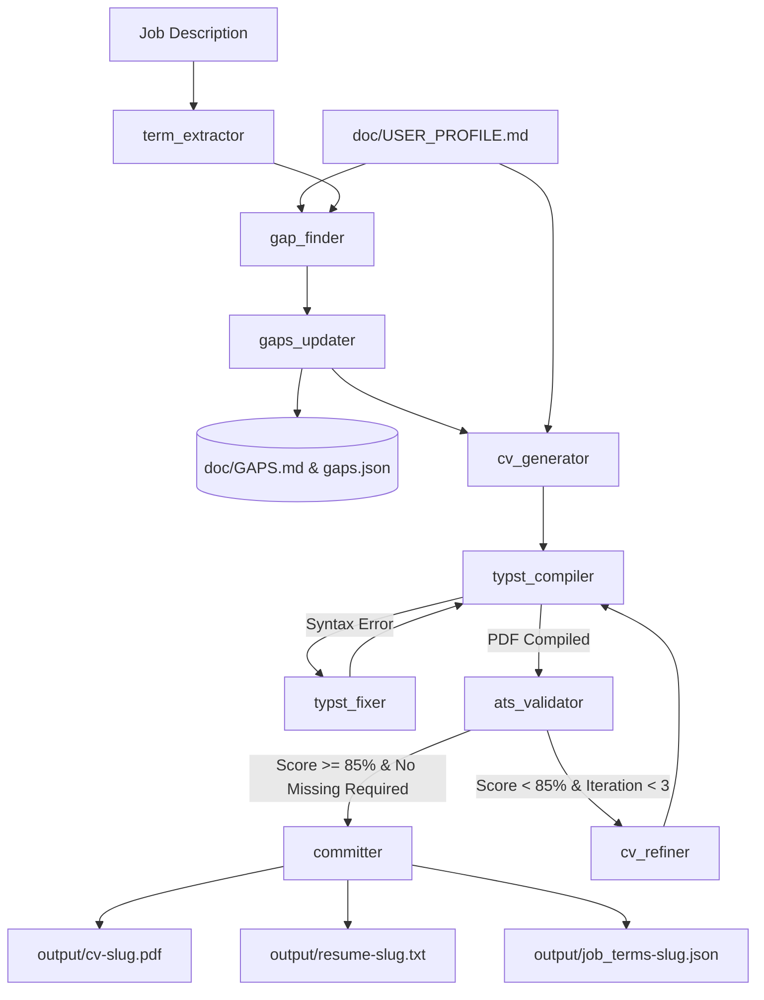

# System Architecture

CVECK treats resume adaptation as a **constrained optimization and compilation problem**, not an open-ended conversational chat task.

---

## Core System Boundaries

### 1. The Factual Single Source of Truth (`doc/USER_PROFILE.md`)
The candidate profile is an invariant boundary. The pipeline has no mechanism or authorization to modify `USER_PROFILE.md`. It can only read the file to extract facts.

### 2. The Feedback Backlog (`doc/GAPS.md` & `doc/gaps.json`)
When the job description demands competencies that do not exist in `USER_PROFILE.md`, they are isolated by `gap_finder` and committed to `gaps.json` and `GAPS.md`. The generator is instructed never to hallucinate or invent these items.

### 3. Local Compilation Engine (`src/tools/typst_runner.py`)
CVECK directly invokes the official Python bindings for **Typst** (`typst.compile()`) to produce standard vector PDFs. It avoids bulky LaTeX distributions and slow Node/Puppeteer browser stacks. Text extraction is performed directly on the binary PDF using `pymupdf` (`fitz`).

### 4. Dynamic Provider Hub (`src/providers.py`)
The system routes LLM requests dynamically between OpenAI-compatible endpoints, Anthropic endpoints, and local inference engines without requiring code changes or application restarts.