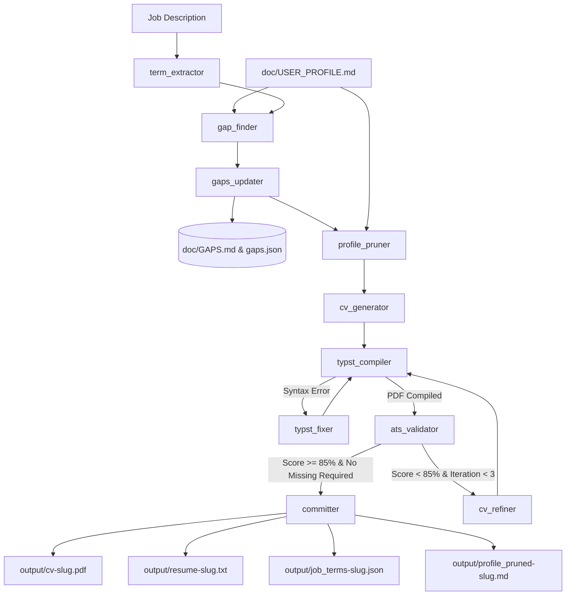

# System Architecture

CVECK treats resume adaptation as a **constrained optimization and compilation problem**, organizing its components using the **Adapter Pattern**. Pure business logic and domain use cases are isolated in the Core, while execution mechanisms (LangGraph, MCP Server, CLI) act as lightweight adapters.

---

## Core System Boundaries

### 1. The Core Engine (`src/core/`)
The Core is completely decoupled from any external runner or framework:
- **Models (`src/core/models/`):** Pure Pydantic schemas (`DomainState`, `JobTerm`, `GapItem`, `ATSReport`, `CompilationResult`, `SubmitPrunedProfile`).
- **Use Cases (`src/core/use_cases/`):** Granular operations executing each step (`extract_terms`, `find_gaps`, `update_gaps`, `prune_profile`, `generate_cv`, `compile_cv`, `fix_typst`, `validate_ats`, `refine_cv`, `commit_artifacts`).
- **Services (`src/core/services/`):** Stateless utility functions for deterministic ATS calculation (`ats.py`), Typst syntax sanitization and compilation (`typst.py`), resilient JSON parsing/repair (`parser.py`), and atomic gap persistence (`backlog.py`).
- **Declarative Workflow (`src/core/workflow.yaml`):** The single source of truth for step definitions, policies (`target_ats_score`, retry caps, bullet budgets), and state transitions.

### 2. The Adapters (`src/adapters/`)
Execution engines interact with the Core strictly via adapters:
- **LangGraph Adapter (`src/adapters/langgraph/`):** Reads `workflow.yaml` dynamically via `builder.py` to construct a cyclic `StateGraph`. `nodes.py` delegates directly to Core use cases, while `router.py` delegates to Core evaluators.
- **MCP Adapter (`src/adapters/mcp/`):** Implements an official Model Context Protocol server exposing tools (`start_resume_tailoring`, `get_tool_instructions`, `submit_job_terms`, `record_gaps`, `compile_typst`, `validate_ats`, `commit_cv`) and the `tailor_resume` prompt.

### 3. Factual Single Source of Truth (`doc/USER_PROFILE.md`)
The candidate profile is an invariant boundary. The pipeline has no mechanism to mutate `USER_PROFILE.md`; it strictly reads the profile to extract facts.

### 4. Skill Gap Backlog (`doc/GAPS.md` & `doc/gaps.json`)
When a job description demands competencies missing from `USER_PROFILE.md`, they are isolated by `find_gaps` and persisted by `update_gaps`. The generator is strictly instructed never to hallucinate or include these items.